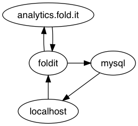

# Foldit server

This repo contains Ansible playbooks for configuring a server to scrape solution data from <analytics.fold.it>.



**Data science workflow.**  
Solutions are scraped into a MySQL database. The workflow is organized around Ansible playbooks. The central script is `bin/scrape.py` which can be run once to scrape all new files on <analytics.fold.it> and push them to cloud storage.

1. `ansible-playbook setup.yml`: Configure the `foldit` server (e.g., set up the MySQL database).
1. `ansible-playbook schedule.yml`: Set a cron job on the FoldIt server for when to run the `bin/scrape.py` script.
1. `ansible-playbook install.yml`: Install/update the scraper on <analytics.fold.it>.
1. `ansible-playbook scrape.yml -e workload=solution-filenames.txt`: Scrape a batch of solutions from <analytics.fold.it>.
1. `ansible-playbook push.yml`: Collect all scraped batches and push them to cloud storage.

**Analyzing the data.**  
To analyze the data, install the R package "pedmiston/foldit-data" from GitHub.  
https://github.com/pedmiston/foldit-data

```R
devtools::install_github("pedmiston/foldit-data")
```

## Getting started

```bash
python3 -m venv ~/.venvs/foldit
source ~/.venvs/foldit/bin/activate
pip install -r requirements.txt
ansible-galaxy install -r requirements.yml
export ANSIBLE_VAULT_PASSWORD_FILE=/path/to/password_file.txt
ansible-playbook setup.yml
```
